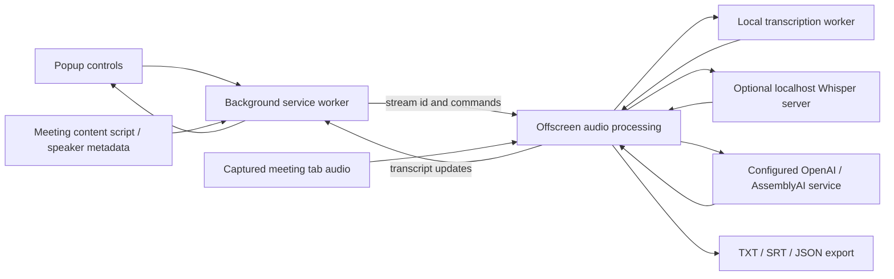

# Extension capture and transcription

As-is source baseline: `8ae08541253c49b326f0264c8fe0b1e28acef155`. Reviewed on 2026-09-17. This describes repository implementation, not verified live deployment state.

The MV3 extension coordinates meeting metadata, tab audio and selectable transcription backends. Browser-local Whisper and the optional Flask server are different execution paths.

## Current architecture and data flow

Start capture obtains a tab stream ID and forwards it to the offscreen document. Audio chunks go through the selected transcription path; content-script speaker observations supplement attribution. Transcript updates return through runtime messaging and exports are generated from the collected transcript. External-provider use sends audio outside the browser; the local server currently has no request authentication.

## Source evidence

- [manifest.json](../../manifest.json)
- [background.js](../../background.js)
- [content-script.js](../../content-script.js)
- [offscreen.js](../../offscreen.js)
- [transcription-worker.js](../../transcription-worker.js)
- [popup.js](../../popup.js)
- [whisper-server/server.py](../../whisper-server/server.py)

## Change planning and maintenance

Before planning, read this map and the [project guide](../PROJECT.md), then inspect the linked implementation. For a significant change, add an explicitly labeled **to-be proposal** under this directory or in the design document, link it here, and show the affected boundaries and data flow. Keep proposed behavior separate from this as-is map. Update the current map, source links and review baseline in the same change that implements the behavior; retire or reconcile the proposal after implementation.

The [documentation deployment workflow](../deployment-documentation.md) defines the repository checks and reporting boundary. A structural check can identify missing or changed documentation, but cannot establish that a diagram matches runtime behavior. Human/code review must verify arrows, ownership, persistence and external dependencies.

Diagram maintenance uses `.nexus/diagrams.json` and `scripts/check-diagrams.py`. After reviewing the staged source changes against this map, update the source fingerprint with the shared checker and stage the metadata. The fingerprint records a review boundary, not semantic proof. Nexus tracks source changes and can open refresh PRs through the development/review workflow; updates remain reviewable PR changes, not assumed automatic merges.
